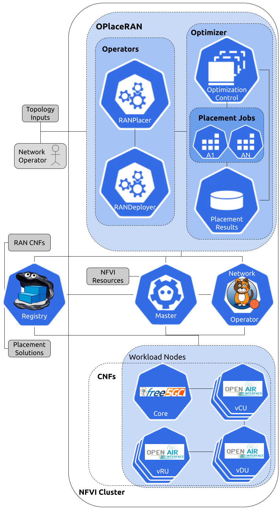

# Description
The  OrchestratorPlacement RAN (OPlaceRAN), a vNG-RAN deployment or-chestrator  framed  within  the  NFV  reference  architecture  andaligned to the O-RAN SMO framework. OPlaceRAN supportsthe  agnostic  placement  of  radio  functions,  focusing  on  theproblem  of  vNG-RAN  planning.  Moreover,  OPlaceRAN  isdesigned  following  the  functional  NFVO  sub-blocks,  consid-ering  the  RO  control  namedRANPlacer,  a  complementaryoptimization module namedRANOptimizer, the NSO controlcalledRANDeployerand, finally, a data repository referred asRANCatalogs.  RANPlacer  handles  the  whole  orchestrationprocess,  including  the  processing  of  external  input  from  theNetwork  Operator  (quantity  of  radio  units),  crosshaul  topol-ogy  capacity,  NFVI  resources,  and  the  alternative  placementsolutions  stored  in  the  RANCatalogs.  RANOptimizer  workswith  both  exact  and  heuristics  agnostic  placement  solutionsaware  of  the  functional  split  requirements.  In  this  case,  theagnostic solution is a strategy of vNG-RAN placement appliedon  the  OPlaceRAN  developed  independently  of  the  orches-trator.  RANDeployer  applies  the  virtualized  radio  functionsaddressed   by   the   placement   approaches   according   to   theRANPlacer  inputs  according  to  the  RAN  CNFs  also  storedin the RANCatalogs. All the configuration, initialization, andvalidation  processes  of  the  virtualized  radio  functions  areperformed and activated by the RANDeployer.
If you have questions or comments, please email us: my5G team.

It is a pleasure to share our knowledge and you are free to use! Please, cite our work as we can continue contributing. Thank you!

@misc{lemes2021tutorial,
    title={A Tutorial on Trusted and Untrusted non-{3GPP} Accesses in {5G} Systems - 
    First Steps Towards a Unified Communications Infrastructure}, 
    author={Mario Teixeira Lemes and Cristiano Bonato Both and 
    Antonio C. de Oliveira Jr. and Kleber Vieira Cardoso},
    year={2021},
    archivePrefix={arXiv},
    primaryClass={cs.NI},
    url={https://arxiv.org/pdf/2109.08976.pdf}
}

# OPlaceRAN


 


# OPlaceRAN Architecture

## Overview
    

The RANPlacer architecture is composed of the following components:

1. RANPlacer: Orchestrates the placement execution and the RANDeployer creation.
2. RANDeployer: Manages the life cycle of the Virtual Network Functions (VNFs).
3. Network Topology: Describes the network topology where the VNFs will be placed.
4. Scheduler Manager: Manages the algorithm's executions.
5. Algorithm Jobs: Execute the placement algorithms and store the results.
6. Storage: Persistence layer that keeps the algorithm required information and results.

### RANPlacer

The RANPlacer is responsible for handling the placement requests
triggered by the Network Operator (NO) input. It triggers the placement algorithm
through the Scheduler API, provides the placement result once it is finished, and
creates the required RANDeployer resources to start the VNFs in the selected nodes.

The RANPlacer receives the following arguments:

1. RAN Topology name.
2. RUs position.
3. Placement Algorithm.
4. Nodes information (Optional - if not provided will be calculated).

### RANDeployer

The RANDeployer is responsible for managing the life-cycle of a chain of
VNFs. A chain is generally composed of a CU, DU, and RU that communicate with
the Core Network (CN).

The RANDeployer creates all the required resources for VNFs execution and cleans
up the environment once deleted.

### Scheduler Manager

The Scheduler Manager receives the requests from the RANPlacer with the inputs
for the algorithm execution. The input is composed of the following information:

1. Nodes Information: Contains the resources (CPU and Memory), node type (Core Network, Aggregation Layer), and links count.
2. Network Topology: Description of the network, such as links and the link's capacity (bandwidth and latency).
3. Algorithm: Defines the placement algorithm that should be used.
4. RUs Position: Describes the number of RUs and where they should be placed.

The Scheduler Manager accepts HTTP `POST` and `GET` requests at the `/scheduler` endpoint.
Initially, a `POST` request with the inputs mentioned above should be executed. The server
will then asynchronously trigger the algorithm job execution and provide the RANPlacer
a token used to get the placement algorithm status and result through an
HTTP `GET` request.

In the future, more endpoints can be added, for example, to register a new algorithm, but
initially, only the `scheduler` endpoint will be available.

### RANOptimizer

The RANOptimizer contain algorithm jobs will be asynchronous tasks as they can take a considerable time to be finished. Also, queuing maybe consider in the future. According to the algorithm chosen by the network operator, a job will be triggered by the selected algorithm. Once the job finishes its execution, it will send the result to a persistency layer accessible by the Scheduler Manager.

## Prototype Details

The architecture is implemented on top of K8S, and for prototyping purposes,
the persistence layer will take advantage of K8S config map resources, avoiding
the complexity of managing a Database. It soon may be necessary to switch to
a proper database.

## Deployment Steps

### Setup core

- First install mongo version 3.6.8 to run core database in one machine acessible by cluster:
```sh
sudo apt-get install sudo apt-get install -y mongodb-org=3.6.8
```

- Change core deployment [file](images/core/core-deployment.yaml) to correct database IP updating env value DB_IP to IP from machine where is running mongo from previsous step;

- Label node or nodes with tag core=true where core is allowed to run, in example bellow it allowed to run in node1:
```sh
kubectl label nodes node1 core=true
```

- Start core:
```sh
kubectl apply -f images/core/core-deployment.yaml
```

### Setup Scheduler

- Just apply deployment and service from scheduler [file](scheduler-manager/k8s/deployment.yaml):

```sh
kubectl apply -f scheduler-manager/k8s/deployment.yaml
```

### Operator

### Operator Dependencies

- Install Go Version 1.14

```sh
kubectl apply -f scheduler-manager/k8s/deployment.yaml &&\
rm -rf /usr/local/go && tar -C /usr/local -xzf go1.14.15.linux-amd64.tar.gz &&\
export PATH=$PATH:/usr/local/go/bin &&\
source $HOME/.profile
```

- Install kustomize

```sh
curl -s "https://raw.githubusercontent.com/kubernetes-sigs/kustomize/master/hack/install_kustomize.sh"  | bash &&\
mv kustomize /usr/bin/
```

- Compile and deploy Ooperator. Go inside k8s-operator/ and:

```sh
make install && make deploy
```

### Deploy a basic chain (CU, DU and RU)

- First get de IP from core pod:

```sh
kubectl get pods -o wide
```

- Edit file [ran_v1alpha1_randeployer.yaml](k8s-operator/config/samples/ran_v1alpha1_randeployer.yaml) and change the coreIP parameter to the address we copied in the previous step:

- And start chain a applying custom resource RANDeployer with command:

```sh
kubectl apply -f k8s-operator/config/samples/ran_v1alpha1_randeployer.yaml
```

### Now label RAN nodes
Running more complex topologies:
Now label the nodes that will be able to receive the VNFs from the RAN. In example bellow nodes1 and 2 are used to master. Other are used to run RAN VNFs nodes.

```sh
kubectl label node node1 oai.unisinos/node-number=0 --overwrite
kubectl label node node2 oai.unisinos/node-number=0 --overwrite
kubectl label node node3 oai.unisinos/node-number=1 --overwrite
kubectl label node node4 oai.unisinos/node-number=2 --overwrite
kubectl label node node5 oai.unisinos/node-number=3 --overwrite
kubectl label node node6 oai.unisinos/node-number=4 --overwrite
```
### Setup Topologies:

- Setup RUs locations in format of file [rus.yaml](k8s-operators/config/samples/ran-placer-config-maps/mini-topo/rus.yaml), where "RU": 0 not will tun RU and 1 will RUN. This spec is used too to define the number of the chains.
- Setup Network links in format of file [topology.yaml](k8s-operators/config/samples/ran-placer-config-maps/mini-topo/topology.yaml). These values are used to algorithm compute teh VNFs locations.
- Apply topology:
```sh
kubectl apply -f k8s-operators/config/samples/ran-placer-config-maps/mini-topo/.
```

### Deploy a customized topology:

- Edit file [ran_v1alpha1_ranplacer.yaml](k8s-operator/config/samples/ran_v1alpha1_ranplacer.yaml) and change the coreIP parameter to the address we copied in the previous step:

- And finally start chain a applying custom resource RANPlacer with command:

```sh
kubectl apply -f k8s-operator/config/samples/ran_v1alpha1_ranplacer.yaml
```


